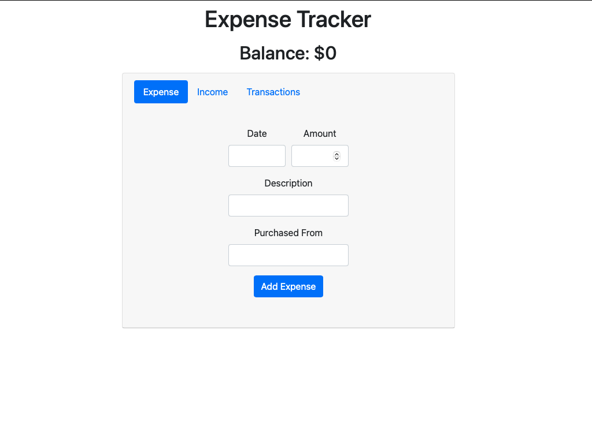

## Expense Tracker

A budget tool written in Javascript, HTML and CSS - uses React with Bootrap 

Try it [here](https://gh-expense-tracker.herokuapp.com)

#### Summary

Coming from the finance world I had to make an expense tracker.  This project was my first time using a front-end framework.  Although challenging
at times to learn, it is clearly beneficial to use over vanilla Javasctipt. The virtual dom helps make react much faster and using reusable components is a
lot easier to read and use. With this project I was able to utilize the many concepts unique to React such as, functional components, JSX, props, state and even
lifecycle methods.  

#### Author

Greg Hilger - Full-Stack Software Developer 
